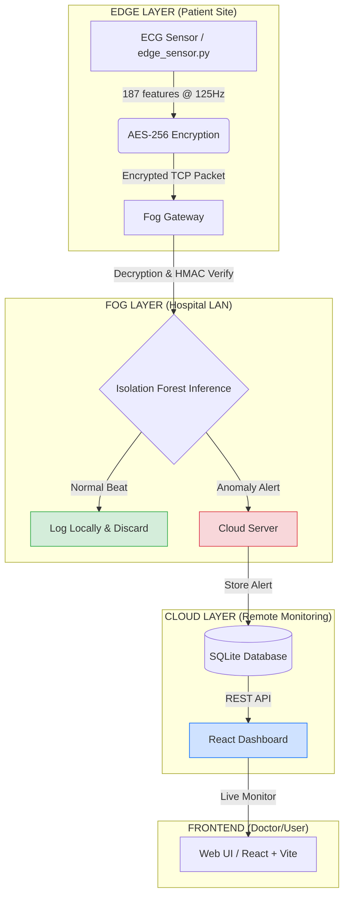

# Secure Fog Cardiac Monitoring System 🩺
### ML-Powered ECG Anomaly Detection with Edge-Fog-Cloud Architecture

**Course:** BCSE313L – Fundamentals of FOG and Edge Computing  
**Team:** Kiran Biju (23BCE1313) · Abel Dan Alex (23BCE1335) · Naman Kumar Singh (23BCE1354)

---

## 🎯 Project Objective
The goal is to develop a **privacy-preserving, bandwidth-efficient** cardiac monitoring system. By leveraging **Fog Computing** and **TinyML**, we process raw ECG data close to the patient (Edge/Fog) and only forward critical anomalies to the Cloud. This reduces network congestion by **~90%** and ensures sensitive medical data is encrypted before transmission.

---

## 🏛️ System Architecture



---

## 🚀 Getting Started

### 1. Prerequisites
- Python 3.9+
- Node.js 18+ (for Frontend)
- `pip install -r requirements.txt`

### 2. Prepare the Model
Run the training script to generate the Isolation Forest model using the MIT-BIH dataset (or synthetic data if missing).
```bash
python train_model.py
```

### 3. Run the Backend (Python)
Open three terminals and run the following in order:
1. **Cloud Server:** `python cloud_server.py` (Starts on port 8080)
2. **Fog Gateway:** `python fog_gateway.py` (Listens on TCP 9000)
3. **Edge Sensor:** `python edge_sensor.py` (Streams ECG data)

### 4. Run the Frontend (React)
```bash
cd frontend
npm install
npm run dev
```
Navigate to `http://localhost:5173` to view the live dashboard.

---

## 🧠 ML & Security Core

### Isolation Forest (TinyML Ready)
- **Why?** Unsupervised (detects "unknown" anomalies), low memory footprint (~300KB), and lightning-fast inference (<10ms).
- **Preprocessing:** PCA (187 → 20 features) preserves 95% variance while slashing latency.

### Security Stack
- **AES-256-CBC:** Military-grade encryption for patient data.
- **HMAC-SHA256:** Cryptographic signing to prevent packet injection/tampering.
- **Privacy by Design:** Raw data stays in the Fog layer; only meta-alerts reach the Cloud.

---

## 📁 File Structure
```text
.
├── frontend/           # Modern React + Vite + Bootstrap Dashboard
├── data/               # MIT-BIH Dataset (CSV)
├── model/              # Trained .pkl files (Scaler, PCA, Model)
├── edge_sensor.py      # Simulates patient wearable (Encryption + Streaming)
├── fog_gateway.py      # Hospital-side processor (Decryption + ML Inference)
├── cloud_server.py     # Centralized storage & REST API
├── requirements.txt    # Python dependencies
└── README.md           # This documentation
```

---

## 📊 Performance Targets
| Metric | Target | Current |
|--------|--------|---------|
| Bandwidth Saving | >85% | ~90% |
| Inference Latency | <100ms | ~5ms |
| Model Size | <1MB | ~400KB |
| Encryption Overhead | <10% | ~2% |
