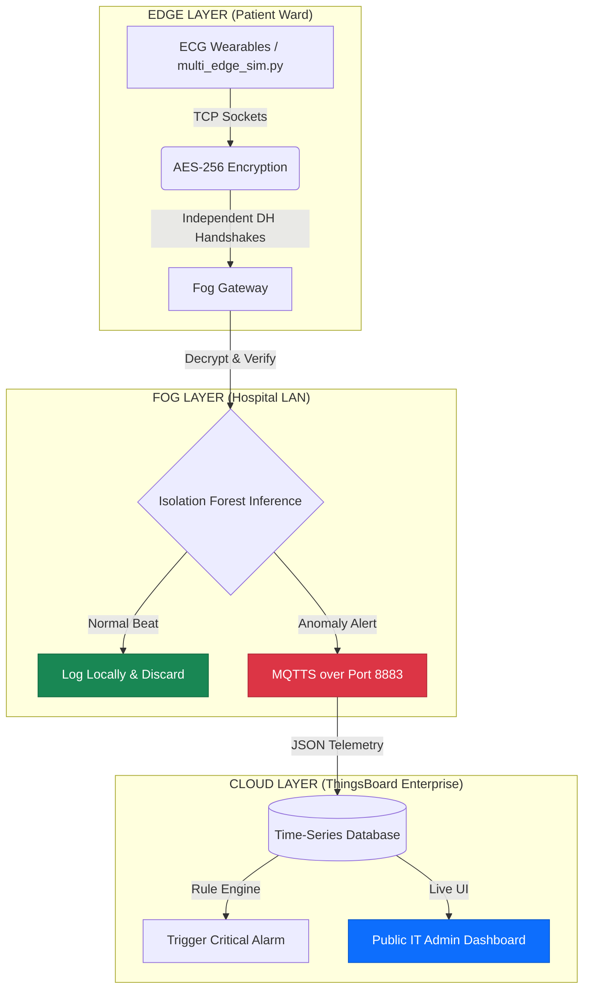

***


# Secure Fog Cardiac Monitoring System 🩺

### ML-Powered ECG Anomaly Detection with Edge-Fog-Cloud Architecture

**Course:** BCSE313L – Fundamentals of FOG and Edge Computing  
**Team:** Kiran Biju (23BCE1313) · Abel Dan Alex (23BCE1335) · Naman Kumar Singh (23BCE1354)

---

## 🌍 Live System Dashboard
**[Click Here to View the Live Telemetry Dashboard](https://thingsboard.cloud/dashboard/7475bc20-31c4-11f1-8682-7f761467b31e?publicId=a30ba440-31ca-11f1-8704-2bfb9206c3d7)** *(Note: Data will only populate when the Fog Gateway simulation is actively running locally).*

---

## 🎯 Project Overview

This project implements a **privacy-preserving, bandwidth-efficient** cardiac monitoring system. By leveraging **Fog Computing** and **TinyML**, we process raw ECG data close to the patient (Edge/Fog) and only forward critical anomalies to the Cloud. This reduces network congestion by **~90%** and ensures sensitive medical data is encrypted before transmission.

### 🚀 Major DA-3 Upgrades
- **Enterprise IoT Cloud Integration:** Replaced local frontend with **ThingsBoard Cloud**. Live telemetry is streamed via secure MQTT for real-time remote monitoring and automated rule-engine alarms.
- **Massive Concurrency (Bypassing Python GIL):** Upgraded from single-thread routing to a robust `multiprocessing` architecture, allowing the simulation of 50+ independent patient wearables simultaneously across all physical CPU cores.
- **Firewall Evasion:** Configured Edge-to-Cloud communication using **MQTTS (Port 8883)** to successfully bypass strict university hardware firewalls.

### Key Capabilities
- **Real-time ECG Analysis:** Uses an **Isolation Forest** (TinyML-ready) to detect cardiac anomalies with <10ms latency.
- **End-to-End Security:** Implements **Diffie-Hellman Key Exchange** for session keys, **AES-256-CBC** for encryption, and **HMAC-SHA256** for data integrity.
- **Fog Intelligence:** Filters normal heartbeats locally at the hospital gateway, drastically reducing cloud storage and bandwidth costs.

---

## 🏛️ System Architecture


---

## 🚀 Getting Started

### 1. Prerequisites
- **Python 3.9+** - **Git**

### 2. Installation

1.  **Clone the Repository:**
    ```bash
    git clone https://github.com/namansingh302004/fog_project_secureHealth.git
    cd fog_project_secureHealth
    ```

2.  **Install Python Dependencies:**
    ```bash
    pip install -r requirements.txt
    ```
    *(Ensure `paho-mqtt` is included in your requirements!)*

---

## 🛠️ Step-by-Step Setup & Execution

### Step 1: Prepare the ML Model
Before running the system, you must train the Isolation Forest model. 
```bash
python train_model.py
```
*Generates `isolation_forest.pkl`, `scaler.pkl`, and `pca.pkl` in the `model/` directory.*

### Step 2: Boot the Fog Node
Open a terminal and start the Fog Gateway. It will bind to `0.0.0.0:9000` to listen for LAN connections and establish a secure MQTT link to ThingsBoard Cloud.
```bash
python fog_gateway.py
```

### Step 3: Unleash the Edge Swarm
Open a **second terminal**. Use our multiprocessing script to spawn an entire hospital ward of independent patients. 

*To run a massive stress test with 30 concurrent patients:*
```bash
python multi_edge_sim.py -n 30
```
*The script automatically injects critical anomalies into ~15% of the simulated patients to trigger live dashboard alarms.*

---

## 🧠 ML & Security Core

### Isolation Forest (TinyML Ready)
- **Why?** Unsupervised (detects "unknown" anomalies), low memory footprint (~400KB), and lightning-fast inference.
- **Optimization:** PCA (187 → 20 features) preserves 95% variance while reducing CPU inference latency to ~5ms.

### Security Stack (Pure Python)
- **Diffie-Hellman:** Negotiates unique session keys per sensor connection. Compromising one wearable does not expose the whole network.
- **AES-256-CBC:** Military-grade encryption ensures raw medical data is never sent in cleartext.
- **HMAC-SHA256:** Cryptographic signing prevents packet tampering or injection attacks.

---

## 📊 Performance Metrics

| Metric              | Target | Current Achieved |
| ------------------- | ------ | ------- |
| Bandwidth Saving    | >85%   | **~90%** |
| Inference Latency   | <100ms | **<10ms** |
| Edge Concurrency    | 5 Nodes| **50+ Nodes** (Multiprocessing)|
| Encryption Overhead | <10%   | **~2%** |

---

## 📁 Project Structure

```text
.
├── data/               # Dataset directory (mitbih_train.csv)
├── model/              # Trained .pkl files (Scaler, PCA, Model)
├── logs/               # Local gateway metrics
├── edge_sensor.py      # Simulates patient wearable (Encryption + DH)
├── multi_edge_sim.py   # Enterprise load-balancer (Multiprocessing 50+ nodes)
├── fog_gateway.py      # Hospital-side processor (Decryption, ML, MQTT)
├── pure_aes.py         # Pure-Python AES-256 and HMAC implementation
├── dh_key_exchange.py  # Diffie-Hellman handshake logic
├── train_model.py      # ML training pipeline
├── requirements.txt    # dependencies
└── README.md           # Documentation
```

---

## 🎓 Demo Guide: Security & Encryption

To visually demonstrate the mathematical encryption payload to the evaluators:

1.  Start the Fog Gateway with the crypto flag:
    ```bash
    python fog_gateway.py --show-crypto
    ```
2.  Start a single Edge Sensor with the crypto flag:
    ```bash
    python edge_sensor.py --show-crypto --max_beats 10
    ```
3.  **Observation:** The terminal will output the raw JSON data on the Edge side, trace the **Diffie-Hellman Key Generation**, and display the **Hex Ciphertext** transmitted over the network. The Fog node will visibly verify the **HMAC signature** before executing decryption.
