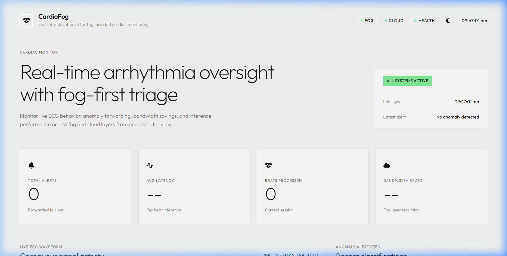
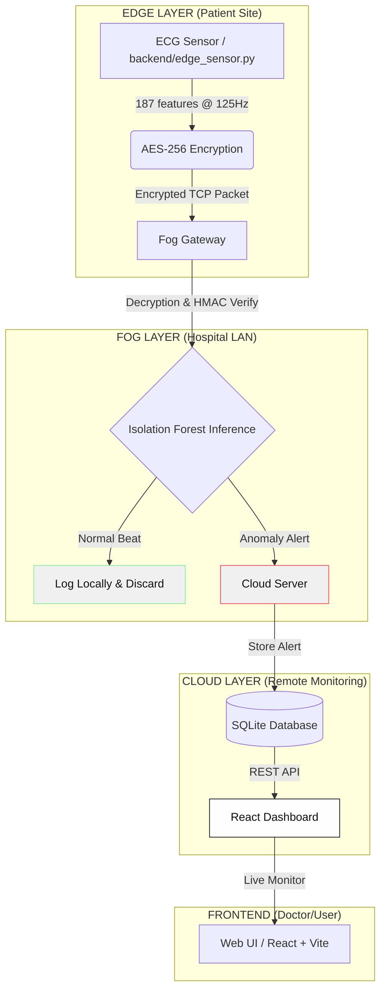

# Secure Fog Computing: Real-Time ECG Anomaly Detection



### ML-Powered ECG Anomaly Detection with Edge-Fog-Cloud Architecture

**Course:** BCSE313L – Fundamentals of FOG and Edge Computing  
**Team:** Kiran Biju (23BCE1313) · Abel Dan Alex (23BCE1335) · Naman Kumar Singh (23BCE1354)

---

## 🎯 Project Overview

This project implements a **privacy-preserving, bandwidth-efficient** cardiac monitoring system. By leveraging **Fog Computing** and **TinyML**, we process raw ECG data close to the patient (Edge/Fog) and only forward critical anomalies to the Cloud. This reduces network congestion by **~90%** and ensures sensitive medical data is encrypted before transmission.

### Key Capabilities
- **Real-time ECG Analysis:** Uses an **Isolation Forest** (TinyML-ready) to detect cardiac anomalies with <10ms latency.
- **End-to-End Security:** Implements **Diffie-Hellman Key Exchange** for session keys, **AES-256-CBC** for encryption, and **HMAC-SHA256** for data integrity.
- **Fog Intelligence:** Filters normal heartbeats locally at the hospital gateway, drastically reducing cloud storage and bandwidth costs.
- **Modern UI & Dashboards:** A meticulously crafted, minimalist React interface featuring high-contrast "editorial" typography, solid monolithic panels, and sophisticated data visualization.

---

## 🏛️ System Architecture



---

## 📁 Project Structure

The project has been refactored for a clean, domain-driven architecture:

```text
fog_project_secureHealth/
├── backend/                  # Python Edge/Fog/Cloud logic
│   ├── cloud_server.py       # Centralized storage & REST API
│   ├── fog_gateway.py        # Hospital-side processor (Decryption + ML)
│   ├── edge_sensor.py        # Simulates patient wearable (Encryption + DH)
│   ├── multi_edge_sim.py     # Simulates multiple concurrent patients
│   ├── pure_aes.py           # Pure-Python AES-256 and HMAC implementation
│   ├── dh_key_exchange.py    # Diffie-Hellman handshake logic
│   ├── train_model.py        # ML training pipeline & ONNX exporter
│   └── requirements.txt      # Python dependencies
├── frontend/                 # React + Vite Dashboard
│   ├── src/                  # Modern UI implementation
│   ├── package.json          
│   └── vite.config.ts        
├── vanilla_dashboard/        # Fallback HTML UI
│   └── dashboard.html        # Lightweight vanilla JS alternative
└── README.md                 # This documentation
```

---

## 🚀 Getting Started

### 1. Prerequisites

- **Python 3.9+** (For Backend and ML)
- **Node.js 18+** (For Frontend Dashboard)
- **Git** (To clone the repository)

### 2. Installation

1.  **Clone the Repository:**
    ```bash
    git clone https://github.com/namansingh302004/fog_project_secureHealth.git
    cd fog_project_secureHealth
    ```

2.  **Install Python Dependencies:**
    ```bash
    cd backend
    pip install -r requirements.txt
    ```

3.  **Install Frontend Dependencies:**
    ```bash
    cd ../frontend
    npm install
    cd ..
    ```

### 3. Environment Configuration

This project is designed to run locally for simulation. No external environment variables are required as the system uses default local ports:
- **Cloud Server:** `8080` (API & Storage)
- **Fog Gateway:** `9000` (Data Reception) & `9001` (Stats API)
- **Frontend:** `5173` (React Development Server)

---

## 🛠️ Step-by-Step Setup & Execution

### Step 1: Prepare the ML Model
Before running the system, you must train the Isolation Forest model. If the MIT-BIH dataset is missing, the script will automatically generate synthetic ECG data for the demo.

```bash
cd backend
python train_model.py
```
*This generates `isolation_forest.pkl`, `scaler.pkl`, and `pca.pkl` in the `backend/model/` directory.*

### Step 2: Run the Backend Services
Open **three separate terminals** and run these in order from the `backend/` directory:

1.  **Cloud Server (Centralized Storage):**
    ```bash
    cd backend
    python cloud_server.py
    ```
2.  **Fog Gateway (Hospital Node):**
    ```bash
    cd backend
    python fog_gateway.py
    ```
3.  **Edge Simulation (Patient Wearable):**
    *Option A (Single Patient):*
    ```bash
    cd backend
    python edge_sensor.py
    ```
    *Option B (Multi-Patient Scalability Demo):*
    ```bash
    cd backend
    python multi_edge_sim.py --num_sensors 4
    ```

### Step 3: Launch the Dashboard
Open a **fourth terminal** to run the monitoring frontend:

```bash
cd frontend
npm run dev
```
Navigate to **`http://localhost:5173`** to view the live cardiac monitor. 

Alternatively, if you prefer the vanilla JS fallback dashboard, simply open `vanilla_dashboard/dashboard.html` in your browser.

---

## 🧠 ML & Security Core

### Isolation Forest (TinyML Ready)
- **Why?** Unsupervised (detects "unknown" anomalies), low memory footprint (~400KB), and lightning-fast inference.
- **Optimization:** PCA (187 → 20 features) preserves 95% variance while reducing latency to ~5ms.

### Security Stack (Pure Python)
- **Diffie-Hellman:** Negotiates unique session keys per sensor connection.
- **AES-256-CBC:** Military-grade encryption ensures raw medical data is never sent in cleartext.
- **HMAC-SHA256:** Cryptographic signing prevents packet tampering or injection attacks.

---

## 📊 Performance Metrics

| Metric              | Target | Current |
| ------------------- | ------ | ------- |
| Bandwidth Saving    | >85%   | ~90%    |
| Inference Latency   | <100ms | ~5ms    |
| Model Size          | <1MB   | ~400KB  |
| Encryption Overhead | <10%   | ~2%     |

---

## 🎓 Demo Guide: Security & Encryption

To demonstrate the secure data flow to a teacher or user:

1.  Start the Fog Gateway with the crypto flag:
    ```bash
    cd backend
    python fog_gateway.py --show-crypto
    ```
2.  Start the Edge Sensor with the crypto flag:
    ```bash
    cd backend
    python edge_sensor.py --show-crypto --max_beats 10
    ```
3.  **Observation:** You will see the raw JSON data on the Edge side, followed by the **Hex Ciphertext** actually sent over the network. The Fog node will show the verification of the **HMAC** and the successful **Decryption** back to JSON for processing.
